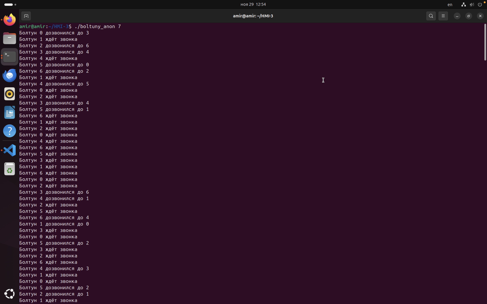
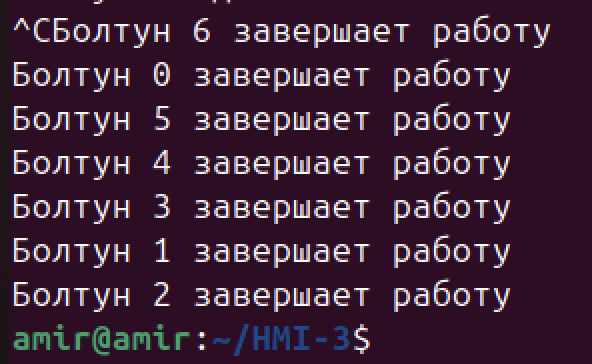
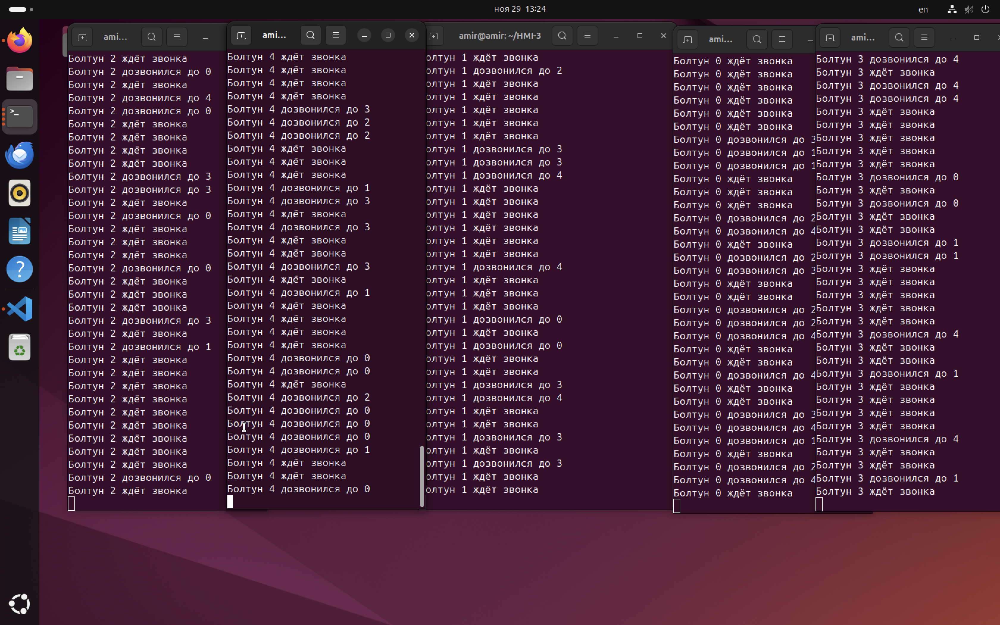
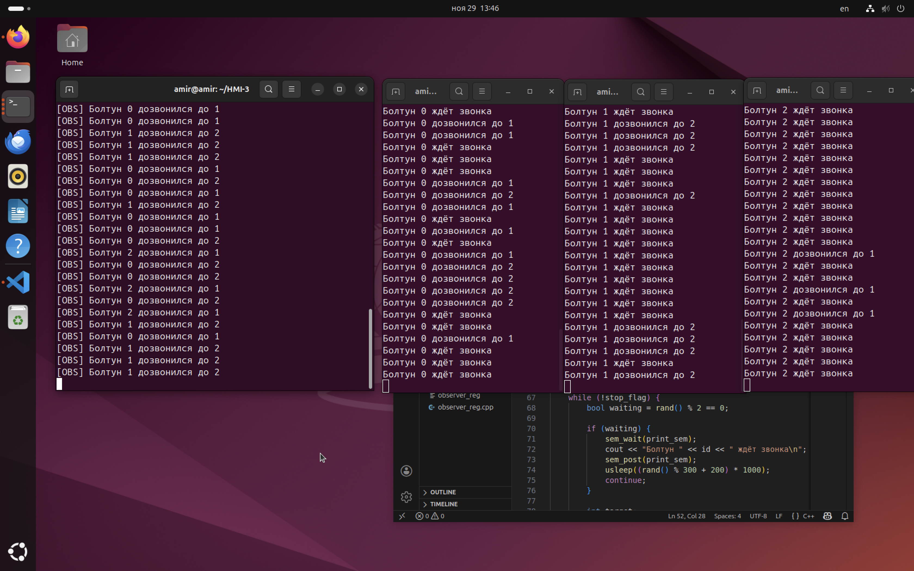

23 Вариант
Садиков Амир БПИ244

**Примечание:** Работу выполнял на виртаульной машине на Ubuntu
# Задача

Задача о болтунах. N болтунов имеют телефоны. Они либо некоторое (случайное) время ждут звонков, либо звонят друг другу, чтобы побеседовать. Если телефон случайного абонента занят, болтун будет звонить другому случайному абоненту, пока ему кто-нибудь не ответит. Побеседовав некоторое время, болтун или ждет звонка, или звонит на другой случайный номер. Создать многопроцессное приложение, моделирующее поведение болтунов. Каждый болтун моделируется отдельным процессом.

### Сценарий моделируемой системы

 процессы и средства IPC.

| Сущность                        | Представление в программе                |
| ------------------------------- | ---------------------------------------- |
| Болтун                          | Отдельный процесс                        |
| Телефон болтуна                 | Бинарный семафор (занят / свободен)      |
| Журнал состояния / общие данные | Разделяемая память                       |
| Звонок                          | Попытка захвата семафора другого болтуна |
| Разговор                        | Обоюдное удержание семафоров участников  |
| Наблюдатели                     | Отдельные процессы + очереди сообщений   |

1. Болтун выбирает случайное действие:  
    • ждать входящего звонка  
    • позвонить кому-то
2. Если решил звонить:
    - выбирает случайного адресата
    - делает `sem_trywait(phone_sem[target])`
    - если телефон занят значит выбирает другого
    - если удалось звонок установлен
3. Во время разговора оба процесса удерживают семафоры
4. После разговора болтун снова выбирает действие.
5. Работа продолжается до получения сигнала SIGINT или завершения эксперимента
### Общая архитектура решение
```c++
struct SharedData {
    int N;                         // количество болтунов
    int phone_busy[20];            // 0 свободен, 1 разговаривает
    char observer_names[20][64];   // имена очередей наблюдателей
    int  observer_count;           // текущее количество наблюдателей
};
```
Защита общего состояния семафоры. Логика звонка: `sem_trywait()` на семафоре целевого болтуна мгновенная проверка и захват.
### 4–6 баллов
- `mmap + MAP_SHARED | MAP_ANONYMOUS`
- неименованные семафоры:
    - `print_sem`
    - `phone_sem[20]`
        
### **7–10 баллов**
- `shm_open(/shm_boltuny23)`
- именованные семафоры:
    - `/sem_bolt_print`
    - `/sem_phone_i`
    - `/sem_bolt_reg` (только 10 баллов)
- POSIX message queues:
    - `/mq_obs` (9 баллов)
    - `/oXXXXX` для каждого наблюдателя (10 баллов)


### Завершение программы и очистка IPC

Все процессы устанавливают обработчик `SIGINT`:
- завершают цикл работы
- освобождают телефонный семафор
- закрывают все открытые семафоры
- отсоединяются от shm
- наблюдатели закрывают очереди сообщений

Программа `cleanup_named` выполняет:
- `shm_unlink("/shm_boltuny23")`
- `sem_unlink("/sem_bolt_print")`
- `sem_unlink("/sem_phone_i")`
- `sem_unlink("/sem_bolt_reg")`
- удаление всех очередей наблюдателей

### Реализация (4–6 баллов)

Анонимные семафоры, один родитель, все дети под его управлением
###  Используемые механизмы
- mmap (анонимная shared memory)
- неименованные POSIX семафоры
- fork() для запуска N процессов
- sem_trywait() для звонков
### Архитектура
Каждый болтун процесс с идентификатором `id ∈ [0; N)`.
`Shared memory`содержит:
- N
- массив состояний телефонов
- массив семафоров телефонов
- семафор `print_sem`

Запуск:
```bash
g++ -std=c++17 -pthread -lrt boltuny_anon.cpp -o boltuny_anon ./boltuny_anon N(ваше число до 20)
```

Результаты работы
- Болтуны конкурируют за семафоры.
- Одновременные разговоры возможны, гонок нет.
- При SIGINT все дочерние процессы завершаются корректно.


### **Реализация (7–8 баллов)**

Именованные семафоры + независимые процессы в разных консолях
### Используемые механизмы
- shm_open
- sem_open (для всех семафоров)
- независимые исполняемые файлы
### Архитектура

Программа `init_named` создаёт:
- `/shm_boltuny23`
- `/sem_bolt_print`
- `/sem_phone_0 ... /sem_phone_N-1`

Каждый болтун:
- открывает `shm`
- открывает свои семафоры
- работает изолированно
### Запуск

```bash
g++ -std=c++17 -pthread -lrt observer_one.cpp -o observer_one
g++ -std=c++17 -pthread -lrt boltun_named_mq.cpp -o boltun_named_mq

./observer_one
./boltun_named_mq 0
./boltun_named_mq 1
...
```

### Результаты
- Каждый процесс работает в собственной консоли.
- Общие семафоры корректно синхронизируют их.
- Система устойчива при любом доступном количестве процессов.


### Реализация (10 баллов)

### Множество динамически подключаемых наблюдателей

### Дополнительные IPC-механизмы

- `observer_names[20][64]` массив очередей
- `/sem_bolt_reg` семафор регистрации наблюдателей
- `observer_reg.cpp` наблюдатель, создающий свою очередь `/oXXXXX`

### Алгоритм наблюдателя
1. Генерирует уникальное имя: `/o<PID mod 100000>`.
2. Создаёт собственную очередь сообщений.
3. Под `sem_bolt_reg` заносит своё имя в shared memory.
4. Читает свою очередь бесконечно.

### Алгоритм болтуна

После каждого действия:
1. Захватывает `/sem_bolt_reg`
2. Проходит по всем `observer_names`
3. Открывает каждую очередь -> `mq_send()`
4. Закрывает очередь
5. Отпускает `/sem_bolt_reg`
###  Запуск

```bash
./cleanup_named
./init_named 6

./boltun_named_multiobs 0
./boltun_named_multiobs 1
./boltun_named_multiobs 2
./boltun_named_multiobs 3
./boltun_named_multiobs 4
./boltun_named_multiobs 5

# В других окнах:
./observer_reg
./observer_reg
./observer_reg
```

### Результаты

- Любое количество наблюдателей можно подключать в реальном времени.
- Все получают одинаковые сообщения.
- Нет гонок, нет конфликтов, нет потери данных.
- `/sem_bolt_reg` гарантирует целостность структуры.

