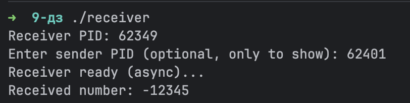
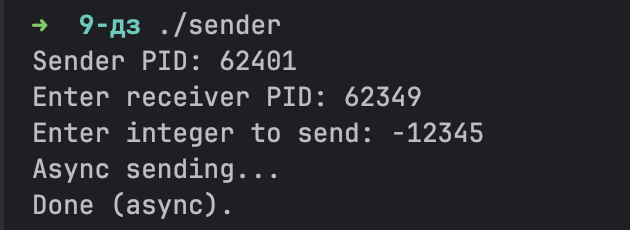

# Домашнее задание № 9

## Реализация

- **receiver.c** приемник 1) выводит свой PID ставит обработчики сигналов до ввода PID отправителя 2) принимает 32 бита числа
каждый бит приходит как:
SIGUSR1 пере\дает бит, который 0
SIGUSR2 передает бит, который 1
после каждого принятого бита отправляет подтверждение (SIGUSR1)
завершает приём по SIGINT  работает полностью асинхронно (в основном цикле один pause())

- **sender.c** передатчик 1) выводит свой PID 2) запрашивает PID receiver запрашивает число начинает отправку с младшего бита  каждый бит отправляется как сигнал:
SIGUSR1 -> 0 SIGUSR2 -> 1
следующий бит отправляется только после подтверждения (сигнал SIGUSR1)
завершает передачу, посылая SIGINT

Почему же асинхронно  

- нет busy waiting

- нет циклов ожидания while(!ack)

- sender не держит CPU потом ждёт сигнал

- receiver не держит CPU потом ждёт сигнал

- передача инициируется только приходом сигнала (event-driven модель)

## Тест

Итог: Такой подход соответствует требованиям на 8/8 баллов.